# Alien Expel — Game Design Document

[← Volver al README](README.md)

**Grupo B** · Alejandro Miguel Cumplido Alastuey, Álvaro Cardos Serrano, Estanislao de Koska Castrillón Román

## Índice

1. [Introducción](#1-introducción)
2. [Especificaciones básicas](#2-especificaciones-básicas)
3. [Jugabilidad](#3-jugabilidad)
4. [Narrativa](#4-narrativa)
5. [Imagen y diseño visual](#5-imagen-y-diseño-visual)
6. [Sonido](#6-sonido)
7. [Interfaz y diagrama de flujo](#7-interfaz-y-diagrama-de-flujo)
8. [Comunicación y marketing](#8-comunicación-y-marketing)
9. [Referencias](#9-referencias)

> **Nota para el alumnado:** este documento es una **plantilla de ejemplo**. Sustituid todos los textos `AAA`, `BBB`, `CCC`... y las imágenes de `img/` por vuestro contenido. Los bloques como este, que empiezan por *Rúbrica*, indican qué criterio de evaluación cubre cada apartado: **borradlos antes de entregar**. Límite orientativo: **3500 palabras**. Todo el documento debe estar en castellano (mezclar idiomas penaliza).

---

## 1. Introducción

### 1.1. Concepto del juego

Alien Expel es un videojuego de persecución y acción asimétrica enfocado en la experiencia de juego de fiesta para varios jugadores. En él, un jugador asumirá el papel de superhéroe enviado con la misión crítica de erradicar una inminente invasión alienígena. Mientras que el resto de jugadores encarnarán a los alienígenas que deberán evitar ser capturados.

### 1.2. Propuesta de valor

Nuestro producto está orientado a entusiastas de los juegos de fiesta para multijugador. Sus características diferenciales son:

- Característica diferencial 1: El bucle jugable se centra en la guerra de desgaste y control del escenario. Pues el bando alienígena tendrá que cooperar haciendo uso de la arquitectura de la nave (bloqueando puertas y usando trampillas). Mientras que el superhéroe debe de gestionar bien sus recursos para dar caza a los invasores.
- Característica diferencial 2: El juego elimina el terror y tensión de otros títulos del género de pilla pilla para ofrecer una experiencia más social, desenfadada y de ritmo frenético, ideal para todo tipo de audiencias.
- Característica diferencial 3: Para potenciar la identidad de los jugadores nuestro juego cuenta con diferentes skins de superhéroes y alienígenas.

*Figura 1. Imagen promocional del juego.*

---

## 2. Especificaciones básicas

| Aspecto | Descripción |
| :--- | :--- |
| **Título** | Alien Expel |
| **Género** | Juego de fiesta |
| **Número de jugadores** | Hasta 4 jugadores (en red o local, tiempo real) |
| **Público objetivo** | Casuales de todas las edades |
| **Clasificación PEGI** | PEGI 3 (no contiene violencia) |
| **Plataforma** | Navegador web (PC), desarrollado con Phaser 3 |
| **Duración de una partida** | 3 minutos |
| **Representación** | 2D |
| **Licencia** | Apache 2.0 |

---

## 3. Jugabilidad

### 3.1. Objetivo del juego

El juego se desarrolla en partidas asimétricas con una duración de tres minutos donde la victoria se disputa entre el superhéroe (cazador) y el bando de los alienígenas (cazados) que se compondrán de 1 a 4 jugadores. Cada bando tiene una condición de victoria mutuamente excluyentes:

- **Condición de victoria del superhéroe**: su objetivo es neutralizar a todos los alienígenas de la nave antes de que se agote el tiempo de la partida. Pese a que su movimiento es más ágil, para lograr atraparlos debe optimizar su estamina siendo eficiente en la persecución y evitando que le roben los recursos de energías que se irán generando por el mapa.
- **Condición de victoria de los alienígenas**: su objetivo es sobrevivir en equipo hasta que el temporizador de la partida llegue a cero. Lograrán esto saboteando el avance del héroe mediante el bloqueo temporal de puertas, el robo de botes de energía y  el uso de trampillas para huir del enemigo.

### 3.2. Controles *pendiente de mapear dibujos

#### 3.2.1. Teclado (Limitado a 2 jugadores locales)

| Acción | Jugador 1 | Jugador 2 |
| :--- | :---: | :---: |
| Moverse hacia arriba |  |  |
| Moverse hacia abajo |  |  |
| Moverse a la izquierda |  |  |
| Moverse a la derecha |  |  |
| Interactuar con botones |  |  |
| Correr (Solo Superhéroe) |  | - |

#### 3.2.2. Configuración de Mando (Estándar Steam Deck)

| Acción | Entrada del Mando (Steam Deck) | Descripción técnica |
| :--- | :---: | :--- |
| **Moverse / Desplazamiento** |  o Stick Izquierdo | Ejes de movimiento en el joystick o la cruceta direccional. |
| **Correr (Solo Héroe)** |  | Se mantiene pulsado para correr al 200%. |
| **Interactuar / Acción Especial** |  | Activa trampillas/puertas (Aliens) o pulsa botones de rampas (Héroe). |
| **Pausa / Menú** |  | Detiene la partida y despliega el menú de opciones local. |

### 3.3. Mecánicas

> *Rúbrica — Jugabilidad / Mecánicas.*

#### 3.3.1. Mecánicas principales

- **Gestión de estamina (Superhéroe):** El superhéroe tiene una velocidad de movimiento mayor que la de los alienígenas. No obstante, este gasta energía constantemente al desplazarse andando, y más aún si se usa el botón de correr. Si su barra de estamina se vacía por completo, queda ralentizado a una velocidad bastante menor que la de los alienígenas hasta que consiga hacerse con un módulo de energía con el cual recuperará parte de esta estamina.
- **Activación de rampas (Superhéroe):** Mecánica exclusiva del perseguidor. El mapa cuenta con zonas con cuadros de luz que el superhéroe puede hackear haciendo que se activen zonas de suelo especial (rampas) por tiempo limitado. Estas rampas permiten al jugador que encarna al superhéroe avanzar a máxima velocidad sin sufrir penalización ni desgaste de su barra de energía.
- **Uso de la arquitectura ambiental (Alienígenas):** Los alienígenas no pueden atacar directamente, pero controlan la arquitectura de la nave nodriza. Pudiendo accionar trampillas para huir por conductos de ventilación y bloquear puertas temporalmente para frenar el avance del superhéroe y obligarlo a buscar rutas alternativas.
- **Sabotaje y robo de recursos (Alienígenas):** Los alienígenas pueden interceptar y recolectar los botes de estamina del escenario antes que el superhéroe. Al hacerlo, eliminan el recurso del mapa, acelerando el desgaste del perseguidor y forzandolo a cambiar su ruta de caza.

#### 3.3.2. Objetos y power-ups

| Objeto/Elemento del mapeado | Efecto | Duración | Aparición |
| :--- | :--- | :---: | :--- |
| Bote de Estamina | Recarga un 25% de la barra de energía del superhéroe. Si lo recoge un alien, el objeto desaparece. | Instantáneo. | Aparición en zonas aleatorias del mapa cada 15 s. Se generan un máximo de 4 botes simultáneos en el mapa, si quedan botes activos sin recolectar (n), solo aparecerán 4 - n botes nuevos. |
| Cuadros de hackeo | Activan rampas de avance sin coste para el superhéroe. | Duración de 10 s. | Pasillos concretos del mapeado. |
| Boton de cierre de puertas | Estos botones permiten a los alienígenas bloquear puertas por tiempo limitado para que el contrincante tenga que elegir otra ruta. | Duración de 15 s. | Zonas concretas del mapeado. |
| Conductos de ventilación | Trampillas que les ofrecen a los alienígenas el modo de escapar de una zona del mapeado a otra. | Tras su uso nadie puede volver a utilizarla en un plazo de 5 s. | Zonas concretas del mapeado. |

#### 3.3.3. Sistema de puntuación

La puntuación final determina la eficiencia de los jugadores al terminar la partida. Para garantizar un sistema equilibrado y competitivo, los puntos se escalan dinámicamente según el número total de alienígenas en la partida (N):

- **Puntuación del superhéroe:**
-- Por captura exitosa: +(400/N) puntos por cada alienígena capturado (así capturar al 100% de la horda siempre otorgará una base fija de 400 puntos ya sea un uno contra uno o un uno contra cuatro).
-- Bonus de tiempo: +((600/tiempo total) * tiempo restante) puntos si logra capturar a todos antes del tiempo límite. Donde tiempo total son los 3 minutos de duración total posible y tiempo restante son los segundos que sobraban en el cronómetro.

- **Puntuación de los alienígenas:**
-- Supervivencia: +((400/tiempo tota*Nl) * sumatorio del tiempo sobrevivido) puntos. Si todos los alienígenas sobreviven la partida completa de 180 segundos, el bando asegura una base fija de 400 puntos (independientemente de si es un uno contra uno  o un uno contra cuatro). A nivel técnico, el bando suma 2.22 puntos por cada segundo que pase con la horda completa en juego, reduciéndose proporcionalmente esta ganancia por cada baja.
-- Sabotaje Colectivo (Hasta 600 puntos): +27.27 puntos por cada bote de estamina robado con éxito entre todos los miembros del equipo, con un tope máximo acumulable de 600 puntos por este concepto (equivalente a robar un máximo de 22 botes colectivos de los 44 totales que pueden aparecer). Esto permite escalar el marcador grupal desde la base de 400 hasta el límite de 1000 puntos.
-- Penalización por captura: -(400/N) puntos en el marcador global del bando por cada jugador que sea atrapado por el superhéroe antes de que termine el tiempo. En un 1vs1 (N=1), ser capturado resta los 400 puntos íntegros de la base de supervivencia y hace terminar la partida de forma directa.

### 3.4. Físicas y dificultad

- **Inercia e impulso de velocidad:** El sistema aplica físicas de movimiento basadas en tres estados de velocidad lineal diferenciados entre los bandos:
-- Superhéroe (Velocidad variable con estamina): Cuenta con dos estados de movimiento orientados a la gestión de recursos. Su velocidad base al caminar (100% de velocidad lineal) consume estamina de forma moderada pero constante. Su velocidad de carrera (200% de velocidad lineal) le permite recortar distancias rápidamente pero triplica la tasa de consumo de su barra de energía.
-- Alienígenas: Se desplazan a una velocidad única, fija e intermedia de 120%. Al no poseer una barra de resistencia, se mueven de forma constante sin sufrir ningún tipo de penalización ni desgaste. Eso les permite superar la caminata del héroe y obligarlo a gastar energía en carrera.
-- Física de impulso en rampas: Al pisar una rampa, el héroe es impulsado a una velocidad de +50% si va andando y +25% si va corriendo. Siendo este el único suelo del mapa donde su consumo de estamina se detiene por completo.

- **Colisiones e interacción física:** El escenario cuenta con colisiones sólidas bidimensionales en paredes, esquinas y puertas pesadas. Existe una caja de colisión estricta entre el superhéroe y los alienígenas; el contacto físico directo entre sus colisionadores activa la mecánica de captura de forma instantánea. Para evitar frustración y bloqueos en pasillos estrechos, las colisiones físicas entre jugadores del mismo bando alienígena están desactivadas, permitiéndoles atravesarse entre sí.

- **Fuerzas de empuje:** Las puertas magnéticas y compuertas de la nave aplican un vector de fuerza de empuje físico hacia atrás si se cierran justo cuando un jugador intenta cruzarlas, desplazando al personaje y penalizando su posición en la persecución. Actuando como paredes normales cuando están completamente cerradas.

- **Superficies de fricción modificada (Cintas transportadoras):** El suelo de la nave cuenta con zonas de cintas transportadoras industriales que aplican una fuerza de arrastre constante en una dirección fija. Si un jugador corre a favor de la cinta, su velocidad física se duplica; si corre en contra, experimenta una resistencia que reduce su velocidad a la mitad.

- **Progresión de la dificultad:** Se plantean 3 mapas diferentes con complejidad creciente.

### 3.5. Escenario

El juego consta de tres escenarios diferentes que representan áreas diferentes de la nave. Estos son seleccionados antes de iniciar la partida.

1. **Zona de habitaciones:** Consta de la sala de control de mandos, los dormitorios y la cafetería.
2. **Zona del hangar:** Consta de talleres de reparación, muelles de lanzamiento y almacenes de carga.
3. **Zona de tareas:** Consta de laboratorios, áreas de entrenamiento y áreas de ocio (cine, recreativas, tiendas).

*Figura 2. Mapa del escenario 1.*

*Figura 3. Mapa del escenario 2.*

*Figura 4. Mapa del escenario 3.*

---

## 4. Narrativa

> *Rúbrica — Narrativa:* riqueza de la historia principal y de los personajes.

### 4.1. Historia

En el año 20XX, la Tierra respira tranquila bajo la protección de "Los Vigilantes de la Órbita", un carismático y poderoso grupo de superhéroes. Sin embargo, la paz global está gestionada en la sombra por la Agencia de Respuesta de Élite (ARE), una organización gubernamental ultrasecreta liderada por el frío y calculador Director Innombrable, un hombre pragmático que ve amenazas alienígenas hasta en una estrella fugaz. La alarma geopolítica se desata cuando los radares de la ARE detectan una nave nodriza entrando en la atmósfera. Sin dudarlo un segundo, Vance activa la línea roja y envía al primer superhéroe disponible al espacio con una orden clara: infiltrarse en la nave y neutralizar la "invasión" a toda costa. 

Al llegar el primer superhéroe, los alienígenas, que venían solo de turismo, comienzan a temer por sus vidas. Los turistas extraterrestres entran en pánico absoluto y empiezan a huir por toda la nave intentando aguantar hasta que esta aterrice de emergencia en la Tierra, si es que consiguen sobrevivir.

Sin embargo, el superhéroe se enfrenta a un problema imprevisto: la atmósfera interna de la nave le debilita de forma continua, consumiendo su Hyper-Estamina a cada segundo. Al darse cuenta de que su agente se está quedando sin energía en pleno espacio exterior, el Director Innombrable interviene desde la base de la ARE hackeando los sistemas de la nave nodriza para enviarle suministros de emergencia. Cada 15 segundos, la agencia teletransporta botes de energía en coordenadas aleatorias del mapa. El problema es que los ingeniosos alienígenas interceptan estas señales y se dedican a robar los botes en la cara del héroe para dejarlo seco, sabiendo que si agotan sus suministros durante los 3 minutos de descenso, el superhéroe quedará indefenso y ellos podrán aterrizar a salvo.

### 4.2. Personajes

#### Superhéroe 1

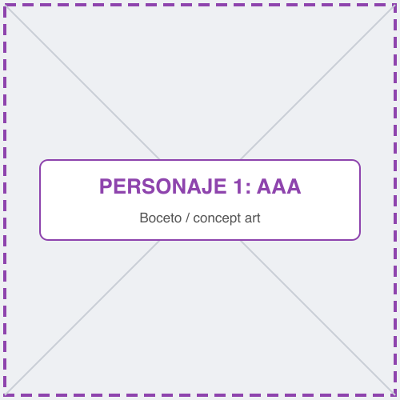

- **Edad / origen:** AAA.
- **Personalidad:** AAA AAA AAA.
- **Motivación:** AAA AAA AAA.
- **Trasfondo:** AAA AAA AAA AAA AAA AAA AAA AAA AAA.

#### Superhéroe 2

- **Edad / origen:** AAA.
- **Personalidad:** AAA AAA AAA.
- **Motivación:** AAA AAA AAA.
- **Trasfondo:** AAA AAA AAA AAA AAA AAA AAA AAA AAA.

#### Superhéroe 3

- **Edad / origen:** AAA.
- **Personalidad:** AAA AAA AAA.
- **Motivación:** AAA AAA AAA.
- **Trasfondo:** AAA AAA AAA AAA AAA AAA AAA AAA AAA.

#### Raza Alienígena 1: Bubble Beast

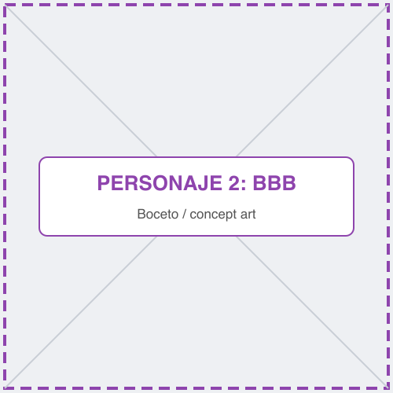

- **Edad / origen:** BBB.
- **Personalidad:** BBB BBB BBB.
- **Motivación:** BBB BBB BBB.
- **Trasfondo:** BBB BBB BBB BBB BBB BBB BBB BBB BBB.

#### Raza Alienígena 2: Ranma

- **Edad / origen:** BBB.
- **Personalidad:** BBB BBB BBB.
- **Motivación:** BBB BBB BBB.
- **Trasfondo:** BBB BBB BBB BBB BBB BBB BBB BBB BBB.

#### Raza Alienígena 3: Carapez

- **Edad / origen:** BBB.
- **Personalidad:** BBB BBB BBB.
- **Motivación:** BBB BBB BBB.
- **Trasfondo:** BBB BBB BBB BBB BBB BBB BBB BBB BBB.

#### Director Innombrable (Personaje no jugable)

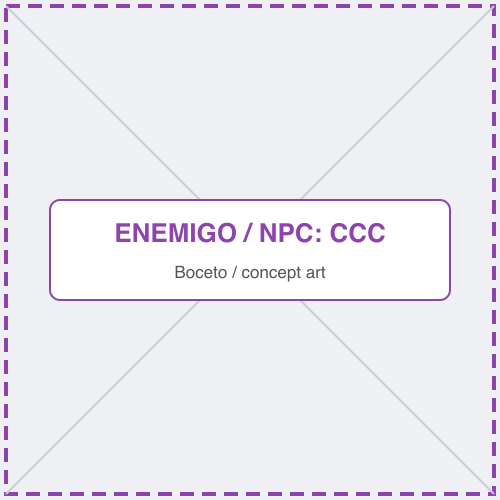

CCC CCC CCC CCC CCC CCC CCC CCC.

---

## 5. Imagen y diseño visual

### 5.1. Logotipo

> *Rúbrica — Imagen / Logotipo.*

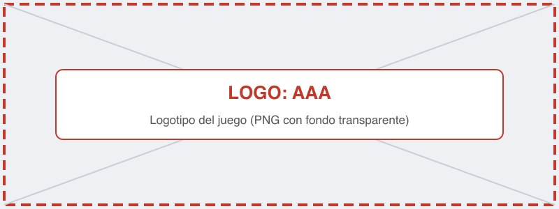

*Figura 3. Logotipo del juego. Tipografía: AAA. Concepto: AAA AAA AAA.*

### 5.2. Estilo visual

> *Rúbrica — Imagen / Estilo visual:* pixel art, cartoon, vectorial, etc.

El juego utiliza un estilo **AAA** (p. ej. *pixel art* de 32×32 píxeles) porque AAA AAA AAA.

### 5.3. Uso de colores

> *Rúbrica — Imagen / Descripción visual:* uso de colores.

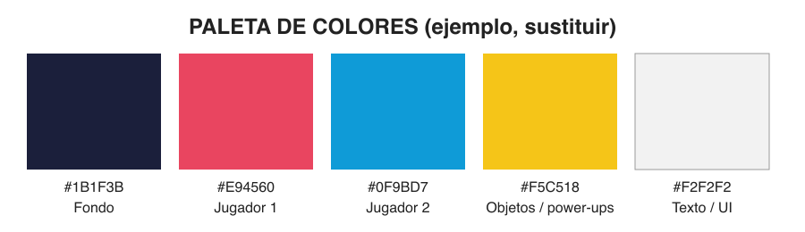

*Figura 4. Paleta de colores del juego.*

- **Fondo (`#1B1F3B`):** AAA AAA AAA.
- **Jugador 1 (`#E94560`) / Jugador 2 (`#0F9BD7`):** colores complementarios para distinguir fácilmente a cada jugador.
- **Objetos (`#F5C518`):** AAA AAA AAA.

### 5.4. Aspectos técnicos: cámara y representación

> *Rúbrica — Imagen / Aspectos técnicos:* uso de cámara y 2D/3D.

- **Representación:** 2D, vista AAA (lateral / cenital / isométrica).
- **Cámara:** AAA (fija mostrando todo el escenario / sigue a ambos jugadores con *zoom* dinámico / pantalla dividida...).
- **Resolución base:** AAA × AAA píxeles.

### 5.5. Inspiración artística y cultural

> *Rúbrica — Imagen / Inspiración:* referentes artísticos y culturales y vínculo con otros trabajos.

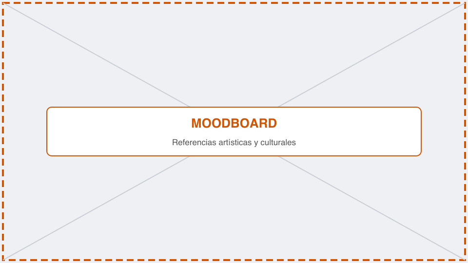

*Figura 5. Moodboard con las referencias visuales.*

- **AAA** (videojuego, año): tomamos AAA AAA AAA [1].
- **BBB** (película / cómic / movimiento artístico): BBB BBB BBB [2].
- **CCC** (referencia cultural): CCC CCC CCC.

### 5.6. Bocetos de personajes y pantallas

> *Rúbrica — Imagen / Bocetos:* interfaz de menú, pantallas y personajes.

Los bocetos de los personajes se encuentran en el apartado [4.2](#42-personajes) y los de las pantallas en el apartado [7.1](#71-pantallas).

---

## 6. Sonido

> *Rúbrica — Sonido:* música y efectos.

### 6.1. Banda sonora

| Pista | Escena | Estilo / ambiente | Fuente / licencia |
| :--- | :--- | :--- | :--- |
| AAA | Menú principal | AAA (p. ej. *chiptune* relajado) | AAA (propia / CC-BY...) |
| BBB | Partida | BBB (p. ej. ritmo rápido, 140 BPM) | BBB |
| CCC | Victoria / derrota | CCC | CCC |

### 6.2. Efectos de sonido

| Efecto | Momento en que se reproduce |
| :--- | :--- |
| Salto | Al pulsar la tecla de salto |
| Golpe / impacto | AAA |
| Recoger objeto | AAA |
| Botones de la interfaz | Al pasar el ratón y al hacer clic |
| Cuenta atrás | AAA |

---

## 7. Interfaz y diagrama de flujo

### 7.1. Pantallas

**Menú principal**

*Figura 6. Menú principal: AAA AAA AAA.*

**Pantalla de juego (HUD)**

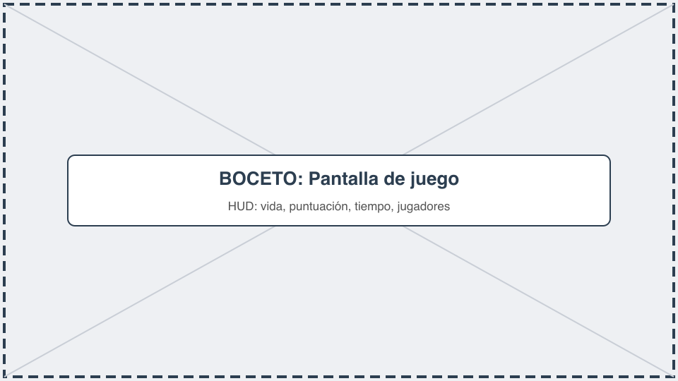

*Figura 7. Pantalla de juego: AAA AAA AAA.*

**Ajustes y fin de partida**

  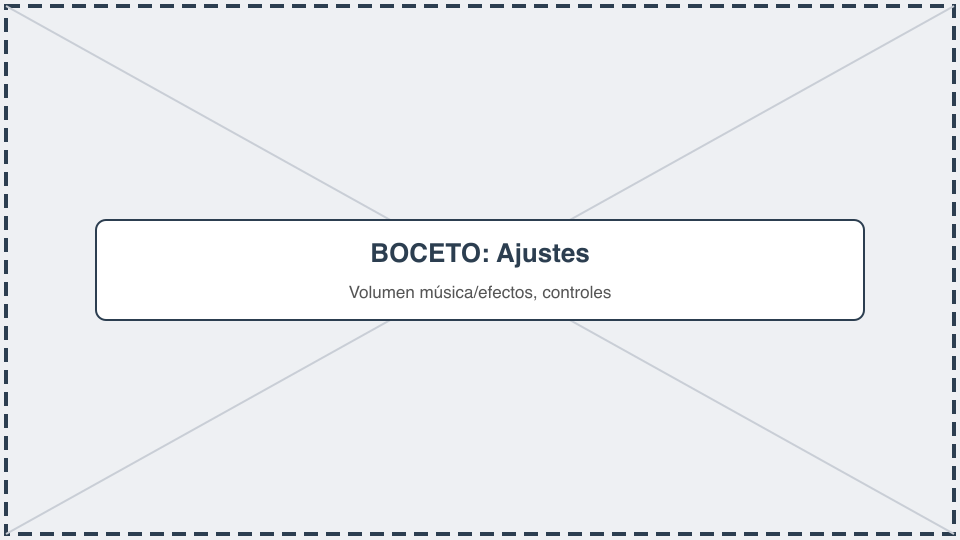
  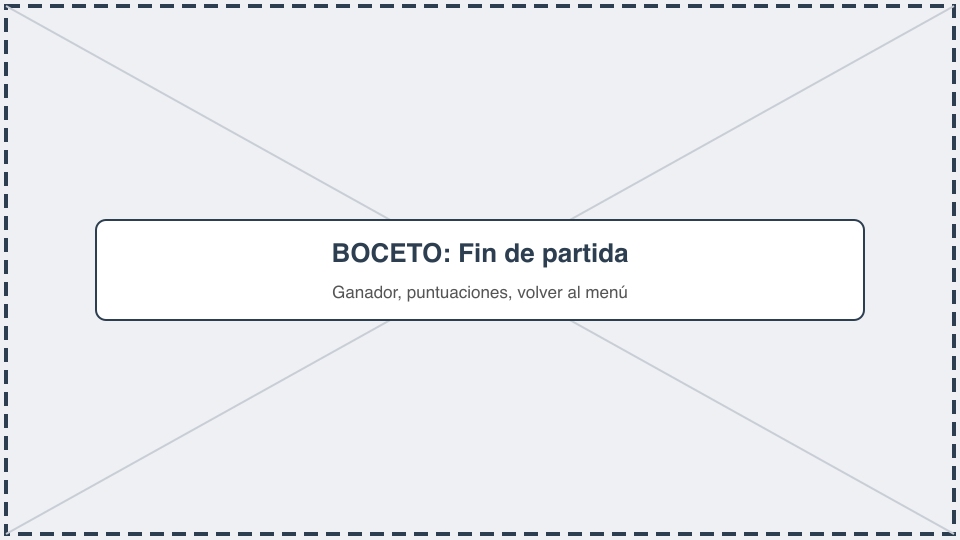

*Figura 8. Pantalla de ajustes (izquierda) y fin de partida (derecha).*

### 7.2. Diagrama de flujo

> *Rúbrica — Documento / Diagrama de flujo.* Podéis usar Mermaid (GitHub lo renderiza directamente) o una imagen exportada.

**Opción 1 — Mermaid** (se dibuja automáticamente en GitHub):

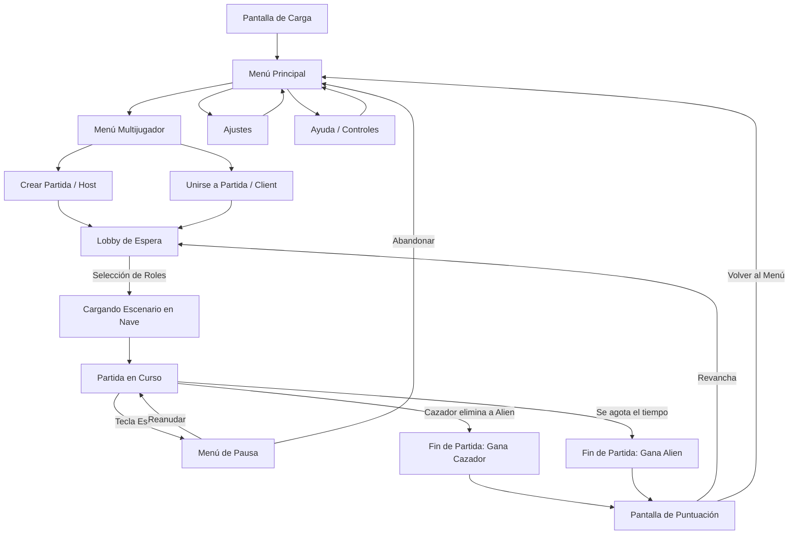

**Opción 2 — Imagen** exportada desde draw.io, Excalidraw, Figma...:

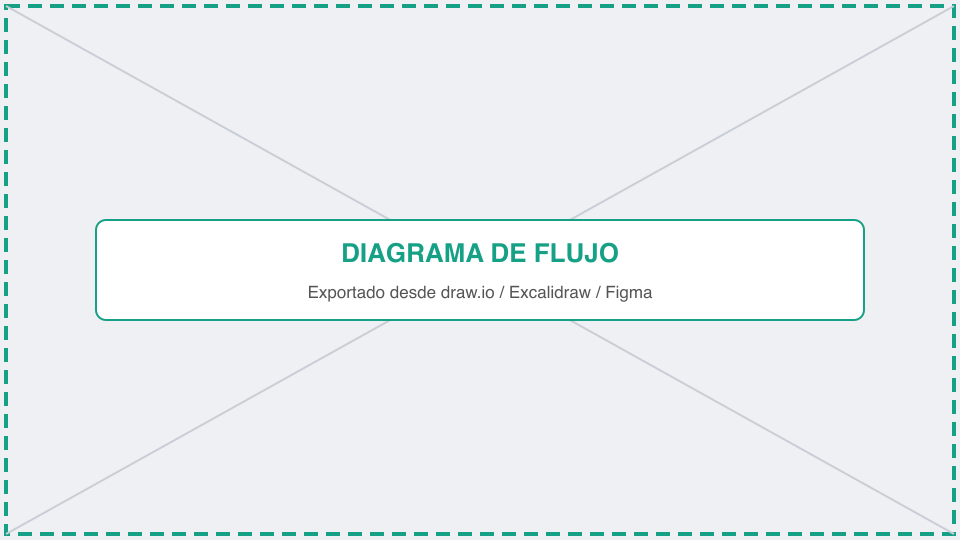

*Figura 9. Diagrama de flujo entre pantallas.*

---

## 8. Comunicación y marketing

> *Rúbrica — Comunicación / Marketing.*

- **Público y mensaje clave:** AAA AAA AAA.
- **Canales:** redes sociales (AAA, BBB), itch.io, Newgrounds, Game Jolt...
- **Calendario:** *teaser* en AAA, *devlog* semanal en AAA, lanzamiento en AAA.
- **Material:** tráiler, capturas, GIF de jugabilidad, *press kit*.
- **Eslogan:** «AAA AAA AAA».

---

## 9. Referencias

> *Rúbrica — Documento / Referencias.* Usad un formato consistente (p. ej. APA) y citadlas en el texto con [1], [2]...

[1] AAA, A. (Año). *Título de la obra*. Editorial / Estudio. URL

[2] BBB, B. (Año). *Título del artículo*. Revista, volumen(número), páginas. https://doi.org/AAA
